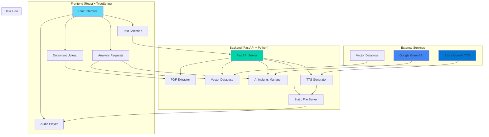

# 🧠 DocMind AI - Intelligent Document Analysis Platform

<div align="center">


**Transform your documents into actionable insights with AI-powered analysis, semantic search, and intelligent podcast generation.**

[🚀 Quick Start](#-quick-start) • [📋 Features](#-features) • [🏗️ Architecture](#️-architecture) • [🔧 Setup](#-setup) • [📖 API Documentation](#-api-documentation) • [🎯 Use Cases](#-use-cases)

</div>

---

## 📋 Table of Contents

- [🎯 Overview](#-overview)
- [✨ Features](#-features)
- [🏗️ Architecture](#️-architecture)
- [🚀 Quick Start](#-quick-start)
- [🔧 Detailed Setup](#-detailed-setup)
- [📖 API Documentation](#-api-documentation)
- [🎯 Use Cases](#-use-cases)
- [🔍 Technical Details](#-technical-details)
- [🤝 Contributing](#-contributing)
- [📄 License](#-license)

---

## 🎯 Overview

DocMind AI is a cutting-edge document analysis platform that leverages artificial intelligence to transform static documents into dynamic, interactive insights. Built with modern technologies and AI capabilities, it provides semantic search, intelligent podcast generation, and strategic analysis of your document library.

### 🎨 Key Highlights

- **🤖 AI-Powered Analysis**: Advanced semantic understanding using Google Gemini
- **🎙️ Intelligent Podcast Generation**: Convert selected text into engaging audio content
- **🔍 Semantic Search**: Find related concepts across your entire document library
- **📊 Strategic Insights**: Uncover hidden patterns and opportunities
- **🎯 Real-time Processing**: Instant analysis and generation capabilities
- **📱 Responsive Design**: Beautiful UI that works on all devices

---

## ✨ Features

### 🧠 Core AI Capabilities

| Feature | Description | Technology |
|---------|-------------|------------|
| **Document Processing** | Extract and analyze PDF content with high accuracy | PyMuPDF, FastAPI |
| **Semantic Search** | Find related concepts across documents | Vector Database, Embeddings |
| **AI Insights** | Generate strategic analysis and recommendations | Google Gemini AI |
| **Podcast Generation** | Convert text to engaging audio content | Azure OpenAI TTS |
| **Similarity Analysis** | Discover connections between documents | Semantic Similarity |

### 🎙️ Advanced Audio Features

- **Text-to-Speech Podcasts**: Generate professional audio content from selected text
- **Multi-Voice Narration**: Natural alternating male/female voices
- **Audio Player Controls**: Play, pause, seek, volume control, and download
- **Real-time Generation**: 5-minute timeout for complex audio processing
- **MP3 Format**: High-quality audio output for all devices

### 🔍 Intelligent Search & Analysis

- **Semantic Similarity**: Find related concepts across your document library
- **Document Clustering**: Group similar documents automatically
- **Context-Aware Search**: Understand meaning, not just keywords
- **Real-time Processing**: Instant results with loading indicators
- **Persistent Storage**: Save and retrieve analysis results

---

## 🏗️ Architecture

### 📐 System Architecture Diagram



### 🔄 Data Flow Architecture


### 🗂️ Project Structure

```
DocMind-AI/
├── 📁 frontend/                 # React TypeScript Application
│   ├── 📁 src/
│   │   ├── 📁 components/       # Reusable UI Components
│   │   ├── 📁 pages/           # Main Application Pages
│   │   ├── 📁 contexts/        # React Context Providers
│   │   ├── 📁 hooks/           # Custom React Hooks
│   │   ├── 📁 utils/           # Utility Functions
│   │   └── 📁 types/           # TypeScript Type Definitions
│   ├── 📁 public/              # Static Assets
│   └── package.json            # Frontend Dependencies
│
├── 📁 backend/                  # FastAPI Python Backend
│   ├── pdf_extractor.py        # Main API Server
│   ├── vector_db_manager.py    # Vector Database Management
│   ├── ai_insights_manager.py  # AI Insights Generation
│   ├── requirements.txt        # Python Dependencies
│   └── 📁 static/              # Generated Audio Files
└── 
```

---

## 🚀 Quick Start

### Prerequisites

- **Node.js** (v18 or higher)
- **Python** (v3.8 or higher)
- **pip** (Python package manager)
- **npm** or **yarn** (Node package manager)

### 1️⃣ Clone the Repository

```bash
git clone https://github.com/yourusername/docmind-ai.git
cd docmind-ai
```

### 2️⃣ Backend Setup

```bash
cd backend
pip install -r requirements.txt
python pdf_extractor.py
```

The backend will start on `http://localhost:8000`

### 3️⃣ Frontend Setup

```bash
cd frontend
npm install
npm run dev
```

The frontend will start on `http://localhost:8080`

### 4️⃣ Access the Application

Open your browser and navigate to `http://localhost:8080`

---

## 🔧 Detailed Setup

### Backend Configuration

#### Environment Variables

Create a `.env` file in the backend directory:

```env
# Google Gemini AI (Required for AI features)
GOOGLE_API_KEY=your_google_gemini_api_key

# Azure OpenAI TTS (Required for podcast generation)
AZURE_OPENAI_API_KEY=your_azure_openai_api_key
AZURE_OPENAI_ENDPOINT=your_azure_openai_endpoint
AZURE_OPENAI_DEPLOYMENT=gpt-4o-mini-tts
AZURE_OPENAI_API_VERSION=2025-03-01-preview
```

#### Python Dependencies

```bash
pip install fastapi uvicorn python-multipart
pip install PyMuPDF python-dotenv
pip install google-generativeai openai
pip install chromadb sentence-transformers
```

### Frontend Configuration

#### Node.js Dependencies

```bash
npm install react react-dom react-router-dom
npm install @types/react @types/react-dom typescript
npm install tailwindcss @tailwindcss/typography
npm install lucide-react clsx tailwind-merge
npm install @radix-ui/react-dialog @radix-ui/react-scroll-area
```

#### Development Scripts

```json
{
  "scripts": {
    "dev": "vite",
    "build": "tsc && vite build",
    "preview": "vite preview",
    "lint": "eslint . --ext ts,tsx --report-unused-disable-directives --max-warnings 0"
  }
}
```

---

## 📖 API Documentation

### Core Endpoints

#### 📄 Document Processing

```http
POST /extract-pdf
Content-Type: multipart/form-data

Response:
{
  "filename": "document.pdf",
  "page_count": 5,
  "text": "Extracted text content...",
  "vector_db_added": true,
  "file_id": "uuid-string"
}
```

#### 🤖 AI Insights

```http
POST /generate-ai-insights
Content-Type: application/json

{
  "selected_text": "Text to analyze...",
  "context": "AI_INSIGHTS_REQUEST"
}

Response:
{
  "insights": [
    {
      "category": "Strategic Analysis",
      "description": "Key insight description...",
      "evidence": "Supporting evidence...",
      "recommendations": ["Action item 1", "Action item 2"]
    }
  ]
}
```

#### 🎙️ TTS Podcast Generation

```http
POST /generate-tts-podcast
Content-Type: application/json

{
  "selected_text": "Text to convert to podcast...",
  "context": "TTS_PODCAST_REQUEST"
}

Response:
{
  "audio_url": "/static/podcast_20241220_143022.mp3",
  "title": "Generated Podcast Title",
  "duration_seconds": 156.5,
  "segments_count": 8,
  "generation_timestamp": "2024-12-20T14:30:22",
  "file_size_mb": 2.45
}
```

#### 🔍 Semantic Similarities

```http
POST /generate-similarities
Content-Type: application/json

{
  "selected_text": "Text to find similarities for...",
  "context": "SIMILARITY_REQUEST"
}

Response:
{
  "similarities": [
    {
      "source_document": "document1.pdf",
      "target_document": "document2.pdf",
      "similarity_score": 0.85,
      "matching_content": "Shared concept description...",
      "source_context": "Context from source...",
      "target_context": "Context from target..."
    }
  ]
}
```

### Error Handling

All endpoints return consistent error responses:

```json
{
  "detail": "Error message description",
  "status_code": 400,
  "timestamp": "2024-12-20T14:30:22"
}
```

---

## 🎯 Use Cases

### 📚 Academic Research

- **Literature Review**: Analyze research papers and find connections
- **Citation Analysis**: Discover related works and references
- **Research Synthesis**: Generate insights from multiple sources

### 💼 Business Intelligence

- **Document Analysis**: Extract insights from reports and presentations
- **Competitive Analysis**: Compare and analyze competitor documents
- **Knowledge Management**: Organize and search company documents

### 🎓 Educational Content

- **Study Material Creation**: Convert textbooks into audio content
- **Concept Mapping**: Visualize relationships between topics
- **Learning Enhancement**: Generate podcasts from study materials

### 📰 Content Creation

- **Podcast Production**: Convert articles into audio content
- **Content Research**: Find related topics and sources
- **Writing Assistance**: Generate insights for content creation

---

## 🔍 Technical Details

### 🤖 AI Models & Technologies

| Component | Technology | Purpose |
|-----------|------------|---------|
| **Text Processing** | PyMuPDF | PDF text extraction |
| **Semantic Search** | Sentence Transformers | Document embeddings |
| **Vector Database** | ChromaDB | Similarity storage |
| **AI Generation** | Google Gemini | Insights and scripts |
| **Text-to-Speech** | Azure OpenAI TTS | Audio synthesis |
| **Frontend** | React + TypeScript | User interface |
| **Backend** | FastAPI | API server |
| **Styling** | Tailwind CSS | Responsive design |

### 🚀 Performance Optimizations

- **Lazy Loading**: Components load on demand
- **Caching**: localStorage for persistent data
- **Optimistic Updates**: Immediate UI feedback
- **Error Boundaries**: Graceful error handling
- **Memory Management**: Efficient resource usage

### 🔒 Security Features

- **CORS Configuration**: Secure cross-origin requests
- **Input Validation**: Pydantic models for data validation
- **Error Handling**: Secure error messages
- **File Validation**: PDF format verification
- **API Rate Limiting**: Request throttling

### 📊 Scalability Considerations

- **Microservices Ready**: Modular architecture
- **Database Agnostic**: Easy to switch vector databases
- **Cloud Compatible**: Docker-ready deployment
- **Horizontal Scaling**: Stateless API design
- **Caching Strategy**: Multiple caching layers

---

## 🤝 Contributing

We welcome contributions! Please follow these guidelines:

### 🛠️ Development Setup

1. Fork the repository
2. Create a feature branch: `git checkout -b feature/amazing-feature`
3. Make your changes
4. Add tests if applicable
5. Commit your changes: `git commit -m 'Add amazing feature'`
6. Push to the branch: `git push origin feature/amazing-feature`
7. Open a Pull Request

### 📝 Code Style

- **Python**: Follow PEP 8 guidelines
- **TypeScript**: Use strict mode and proper typing
- **React**: Use functional components with hooks
- **CSS**: Use Tailwind CSS utility classes

### 🧪 Testing

```bash
# Backend tests
cd backend
python -m pytest

# Frontend tests
cd frontend
npm test
```

### 📚 Documentation

- Update README for new features
- Add API documentation
- Include code comments
- Create usage examples

---

## 📄 License

This project is licensed under the MIT License - see the [LICENSE](LICENSE) file for details.

### 📋 License Summary

- ✅ **Commercial Use**: Allowed
- ✅ **Modification**: Allowed
- ✅ **Distribution**: Allowed
- ✅ **Private Use**: Allowed
- ❌ **Liability**: Limited
- ❌ **Warranty**: Limited

---

## 🙏 Acknowledgments

- **Google Gemini AI** for advanced language understanding
- **Azure OpenAI** for high-quality text-to-speech
- **FastAPI** for the excellent web framework
- **React** for the powerful frontend library
- **Tailwind CSS** for the beautiful design system

---

<div align="center">

**Made with ❤️ by the DocMind AI Team**

[](https://github.com/yourusername/docmind-ai)
[](https://github.com/yourusername/docmind-ai)
[](https://github.com/yourusername/docmind-ai/issues)

</div>
