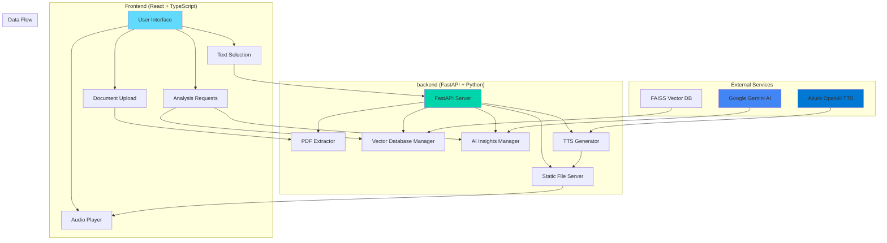
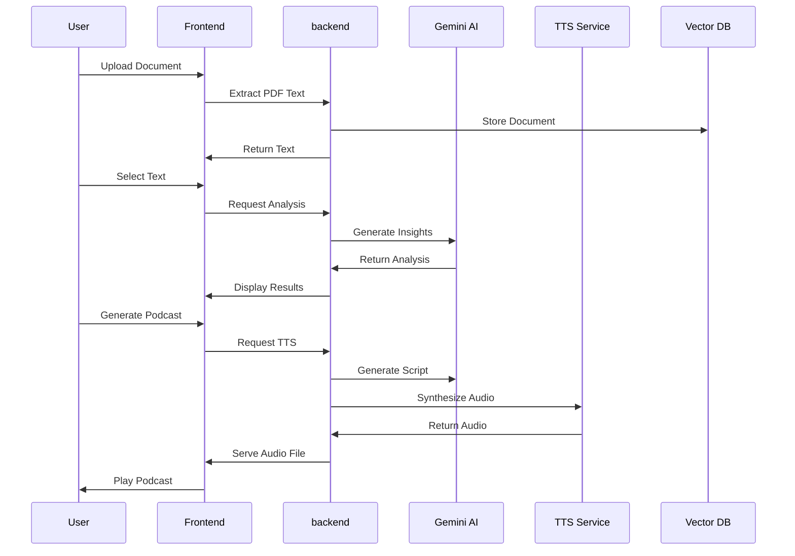

# 🧠 DocMind AI - Intelligent Document Analysis Platform

<div align="center">

🎥 [Demo Video](https://drive.google.com/file/d/1DOhQqFFGih0hsMtsBjMiTs4lNgXOkOjr/view?usp=sharing)


**Transform your documents into actionable insights with AI-powered analysis, semantic search, and intelligent podcast generation.**

[🚀 Quick Start](#-quick-start) • [📋 Features](#-features) • [🏗️ Architecture](#️-architecture) • [🔧 Setup](#-setup) • [📖 API Documentation](#-api-documentation) • [🎯 Use Cases](#-use-cases)

</div>

---

## 📋 Table of Contents

- [🎯 Overview](#-overview)
- [✨ Features](#-features)
- [🏗️ Architecture](#️-architecture)
- [🚀 Quick Start](#-quick-start)
- [🔧 Detailed Setup](#-detailed-setup)
- [📖 API Documentation](#-api-documentation)
- [🎯 Use Cases](#-use-cases)
- [🔍 Technical Details](#-technical-details)
- [🤝 Contributing](#-contributing)
- [📄 License](#-license)

---

## 🎯 Overview

DocMind AI is a cutting-edge document analysis platform that leverages artificial intelligence to transform static documents into dynamic, interactive insights. Built with modern technologies and AI capabilities, it provides semantic search, intelligent podcast generation, and strategic analysis of your document library.

### 🎨 Key Highlights

- **🤖 AI-Powered Analysis**: Advanced semantic understanding using Google Gemini
- **🎙️ Intelligent Podcast Generation**: Convert selected text into engaging audio content
- **🔍 Semantic Search**: Find related concepts across your entire document library
- **📊 Strategic Insights**: Uncover hidden patterns and opportunities
- **🎯 Real-time Processing**: Instant analysis and generation capabilities
- **📱 Responsive Design**: Beautiful UI that works on all devices
- **🐳 Docker Ready**: Single command deployment for production

---

## ✨ Features

### 🧠 Core AI Capabilities

| Feature | Description | Technology |
|---------|-------------|------------|
| **Document Processing** | Extract and analyze PDF content with high accuracy | PyMuPDF, FastAPI |
| **Semantic Search** | Find related concepts across documents | FAISS, Sentence Transformers |
| **AI Insights** | Generate strategic analysis and recommendations | Google Gemini AI |
| **Podcast Generation** | Convert text to engaging audio content | Azure OpenAI TTS |
| **Similarity Analysis** | Discover connections between documents | Semantic Similarity |

### 🎙️ Advanced Audio Features

- **Text-to-Speech Podcasts**: Generate professional audio content from selected text
- **Multi-Voice Narration**: Natural alternating male/female voices (coral/onyx)
- **Audio Player Controls**: Play, pause, seek, volume control, and download
- **Real-time Generation**: 5-minute timeout for complex audio processing
- **MP3 Format**: High-quality audio output for all devices

### 🔍 Intelligent Search & Analysis

- **Semantic Similarity**: Find related concepts across your document library
- **Document Clustering**: Group similar documents automatically
- **Context-Aware Search**: Understand meaning, not just keywords
- **Real-time Processing**: Instant results with loading indicators
- **Persistent Storage**: Save and retrieve analysis results

---

## 🏗️ Architecture

### 📐 System Architecture Diagram



### 🔄 Data Flow Architecture



### 🗂️ Project Structure

```
Adobe-Finals-TeamX/
├── 📁 frontend/                 # React TypeScript Application
│   ├── 📁 src/
│   │   ├── 📁 components/       # Reusable UI Components
│   │   │   ├── 📁 layout/       # Layout Components
│   │   │   └── 📁 ui/           # UI Components
│   │   ├── 📁 pages/           # Main Application Pages
│   │   ├── 📁 contexts/        # React Context Providers
│   │   ├── 📁 hooks/           # Custom React Hooks
│   │   ├── 📁 utils/           # Utility Functions
│   │   └── 📁 lib/             # Library Functions
│   ├── 📁 public/              # Static Assets
│   └── package.json            # Frontend Dependencies
│
├── 📁 backend/                  # FastAPI Python backend
│   ├── pdf_extractor.py        # Main API Server
│   ├── vector_db_manager.py    # Vector Database Management
│   ├── ai_insights_manager.py  # AI Insights Generation
│   ├── requirements.txt        # Python Dependencies
│   └── 📁 static/              # Generated Audio Files
│
├── 📄 Dockerfile               # Multi-stage Docker build
├── 📄 .dockerignore            # Docker ignore patterns
├── 📄 build.sh                 # Build script
└── 📄 README.md               # This file
```

---

## 🚀 Quick Start

### 🔑 Adobe Embed API Setup (Important!)
Before running the Docker container, ensure your Adobe Embed API key is properly configured:

1. **Get Adobe Embed API Key**: Visit [Adobe Embed API](https://www.adobe.com/go/dcsdks_credentials)
2. **Configure Domain**: Add `localhost` to your Adobe API key's allowed domains
3. **Test Domain**: Ensure your app works at `http://localhost:8080` (not `127.0.0.1:8080`)

### 🐳 Docker Deployment (Recommended)

The Adobe evaluation team will use this **exact command** with their own API keys:

```bash
docker run \
  -e ADOBE_EMBED_API_KEY=<THEIR_ADOBE_KEY> \
  -e LLM_PROVIDER=gemini \
  -e GOOGLE_API_KEY=<THEIR_GOOGLE_KEY> \
  -e GEMINI_MODEL=gemini-2.5-pro \
  -e TTS_PROVIDER=azure \
  -e AZURE_TTS_KEY=<THEIR_AZURE_KEY> \
  -e AZURE_TTS_ENDPOINT=<THEIR_AZURE_ENDPOINT> \
  -e AZURE_TTS_DEPLOYMENT=tts \
  -p 8080:8080 \
  adobe-finals-teamx:latest
```

### 🔑 Required Environment Variables

| Variable | Description | Example |
|----------|-------------|---------|
| `ADOBE_EMBED_API_KEY` | Adobe Embed API key for PDF embedding | `your_adobe_key_here` |
| `LLM_PROVIDER` | LLM provider (set to `gemini`) | `gemini` |
| `GOOGLE_API_KEY` | Google API key for Gemini LLM | `your_google_key_here` |
| `GEMINI_MODEL` | Gemini model to use | `gemini-2.5-pro` |
| `TTS_PROVIDER` | Text-to-speech provider | `azure` |
| `AZURE_TTS_KEY` | Azure TTS API key | `your_azure_key_here` |
| `AZURE_TTS_ENDPOINT` | Azure TTS endpoint URL | `https://your-resource.openai.azure.com/` |
| `AZURE_TTS_DEPLOYMENT` | Azure TTS deployment name | `tts` |

### 🌐 Access the Application

Once the container is running, access the application at:
**http://localhost:8080**

### 🚨 Common Issues & Solutions

#### Adobe Embed API CORS Issues
- **Problem**: Adobe API blocks requests from Docker containers
- **Solution**: Ensure your Adobe API key has `localhost` in allowed domains
- **Test**: Access via `http://localhost:8080` (not `127.0.0.1:8080`)

#### Container Won't Start
- **Problem**: Port 8080 already in use
- **Solution**: Stop other services or use different port: `-p 8081:8080`

#### Frontend Not Loading
- **Problem**: Static files not found
- **Solution**: Ensure Docker build completed successfully
- **Check**: Run `docker logs <container_id>` for errors

---

## 🔧 Detailed Setup

### 🐳 Docker Setup

#### 1. Build the Docker Image

```bash
# Clone the repository
git clone <your-repo-url>
cd Adobe-Finals-TeamX

# Build the Docker image
docker build -t adobe-finals-teamx:latest .
```

#### 2. Run with Your API Keys

```bash
docker run \
  -e ADOBE_EMBED_API_KEY=your_adobe_key \
  -e LLM_PROVIDER=gemini \
  -e GOOGLE_API_KEY=your_google_key \
  -e GEMINI_MODEL=gemini-2.5-pro \
  -e TTS_PROVIDER=azure \
  -e AZURE_TTS_KEY=your_azure_key \
  -e AZURE_TTS_ENDPOINT=https://your-resource.openai.azure.com/ \
  -e AZURE_TTS_DEPLOYMENT=tts \
  -p 8080:8080 \
  adobe-finals-teamx:latest
```

### 🔧 Manual Development Setup

#### Prerequisites

- **Node.js** (v18 or higher)
- **Python** (v3.11 or higher)
- **pip** (Python package manager)
- **npm** or **yarn** (Node package manager)

#### 1️⃣ Clone the Repository

```bash
git clone <your-repo-url>
cd Adobe-Finals-TeamX
```

#### 2️⃣ backend Setup

```bash
cd backend

# Install Python dependencies
pip install -r requirements.txt

# Set environment variables
export GOOGLE_API_KEY=your_google_key
export AZURE_TTS_KEY=your_azure_key
export AZURE_TTS_ENDPOINT=https://your-resource.openai.azure.com/

# Start the backend server
python run_server.py
```

The backend will start on `http://localhost:8000`

#### 3️⃣ Frontend Setup

```bash
cd frontend

# Install Node.js dependencies
npm install

# Start the development server
npm run dev
```

The frontend will start on `http://localhost:5173`

#### 4️⃣ Access the Application

Open your browser and navigate to `http://localhost:5173`

---

## 📖 API Documentation

### Core Endpoints

#### 📄 Document Processing

```http
POST /extract-pdf
Content-Type: multipart/form-data

Response:
{
  "filename": "document.pdf",
  "page_count": 5,
  "text": "Extracted text content...",
  "vector_db_added": true,
  "file_id": "uuid-string"
}
```

#### 🤖 AI Insights

```http
POST /ai-insights
Content-Type: application/json

{
  "selected_text": "Text to analyze...",
  "context": "AI_INSIGHTS_REQUEST"
}

Response:
{
  "selected_text": "Original text...",
  "insights": {
    "summary": "AI-generated summary...",
    "insights": [
      {
        "type": "discovery",
        "title": "Key Insight Title",
        "description": "Detailed insight description...",
        "evidence": "Supporting evidence...",
        "confidence": 0.95,
        "impact": "High",
        "category": "Strategic Analysis"
      }
    ],
    "cross_document_analysis": {
      "agreements": ["Agreement 1", "Agreement 2"],
      "disagreements": ["Disagreement 1"],
      "gaps": ["Gap 1", "Gap 2"],
      "evolution": "Evolution description..."
    },
    "actionable_recommendations": ["Recommendation 1", "Recommendation 2"]
  },
  "related_documents": 5,
  "analysis_timestamp": "2024-12-20T14:30:22"
}
```

#### 🎙️ TTS Podcast Generation

```http
POST /generate-tts-podcast
Content-Type: application/json

{
  "selected_text": "Text to convert to podcast...",
  "context": "TTS_PODCAST_REQUEST"
}

Response:
{
  "audio_url": "/static/podcast_20241220_143022.mp3",
  "title": "Generated Podcast Title",
  "duration_seconds": 156.5,
  "segments_count": 8,
  "generation_timestamp": "2024-12-20T14:30:22",
  "file_size_mb": 2.45
}
```

#### 🔍 Semantic Similarities

```http
POST /similarity-search
Content-Type: application/json

{
  "query_text": "Text to find similarities for...",
  "top_k": 10,
  "min_similarity": 0.3
}

Response:
{
  "query": "Original query text...",
  "results": [
    {
      "content": "Similar content found...",
      "metadata": {
        "file_id": "uuid",
        "filename": "document.pdf",
        "chunk_id": "chunk-uuid",
        "chunk_index": 1,
        "total_chunks": 5,
        "timestamp": "2024-12-20T14:30:22",
        "content_preview": "Preview of content..."
      },
      "similarity_score": 0.85,
      "similarity_percentage": 85
    }
  ],
  "total_found": 5,
  "search_timestamp": "2024-12-20T14:30:22"
}
```

#### 💬 PDF Chatbot

```http
POST /api/pdf-chat
Content-Type: application/json

{
  "question": "What is the main topic of this document?",
  "pdf_content": "Document content...",
  "pdf_name": "document.pdf"
}

Response:
{
  "answer": "AI-generated answer...",
  "confidence": 0.92,
  "is_relevant": true,
  "context_used": "Relevant context from document..."
}
```

### Error Handling

All endpoints return consistent error responses:

```json
{
  "detail": "Error message description",
  "status_code": 400,
  "timestamp": "2024-12-20T14:30:22"
}
```

### Health Check

```http
GET /health

Response:
{
  "status": "healthy",
  "message": "backend is running"
}
```

---

## 🎯 Use Cases

### 📚 Academic Research

- **Literature Review**: Analyze research papers and find connections
- **Citation Analysis**: Discover related works and references
- **Research Synthesis**: Generate insights from multiple sources
- **Study Material Creation**: Convert textbooks into audio content

### 💼 Business Intelligence

- **Document Analysis**: Extract insights from reports and presentations
- **Competitive Analysis**: Compare and analyze competitor documents
- **Knowledge Management**: Organize and search company documents
- **Strategic Planning**: Generate insights for business decisions

### 🎓 Educational Content

- **Study Material Creation**: Convert textbooks into audio content
- **Concept Mapping**: Visualize relationships between topics
- **Learning Enhancement**: Generate podcasts from study materials
- **Content Research**: Find related topics and sources

### 📰 Content Creation

- **Podcast Production**: Convert articles into audio content
- **Content Research**: Find related topics and sources
- **Writing Assistance**: Generate insights for content creation
- **Audio Content**: Create engaging audio from written content

---

## 🔍 Technical Details

### 🤖 AI Models & Technologies

| Component | Technology | Purpose |
|-----------|------------|---------|
| **Text Processing** | PyMuPDF | PDF text extraction |
| **Semantic Search** | Sentence Transformers | Document embeddings |
| **Vector Database** | FAISS | Similarity storage |
| **AI Generation** | Google Gemini 2.5 Pro | Insights and scripts |
| **Text-to-Speech** | Azure OpenAI TTS | Audio synthesis |
| **Frontend** | React + TypeScript | User interface |
| **backend** | FastAPI | API server |
| **Styling** | Tailwind CSS | Responsive design |
| **Container** | Docker | Deployment |

### 🚀 Performance Optimizations

- **Multi-stage Docker Build**: Optimized image size
- **Lazy Loading**: Components load on demand
- **Caching**: localStorage for persistent data
- **Optimistic Updates**: Immediate UI feedback
- **Error Boundaries**: Graceful error handling
- **Memory Management**: Efficient resource usage
- **Health Checks**: Container monitoring

### 🔒 Security Features

- **Environment Variables**: No hardcoded secrets
- **CORS Configuration**: Secure cross-origin requests
- **Input Validation**: Pydantic models for data validation
- **Error Handling**: Secure error messages
- **File Validation**: PDF format verification
- **API Rate Limiting**: Request throttling

### 📊 Scalability Considerations

- **Microservices Ready**: Modular architecture
- **Database Agnostic**: Easy to switch vector databases
- **Cloud Compatible**: Docker-ready deployment
- **Horizontal Scaling**: Stateless API design
- **Caching Strategy**: Multiple caching layers
- **Container Orchestration**: Kubernetes ready

---

## 🧪 Testing Checklist for Adobe Team

The evaluation team should test these features:

- [ ] **Docker Build**: `docker build -t adobe-finals-teamx:latest .`
- [ ] **Container Startup**: Container starts within 30 seconds
- [ ] **Health Check**: `curl http://localhost:8080/health`
- [ ] **Application Access**: http://localhost:8080 loads successfully
- [ ] **Document Upload**: Upload PDF documents (similar to Round 1A/1B)
- [ ] **PDF Rendering**: View and interact with uploaded PDFs
- [ ] **Text Selection**: Select text within PDF documents
- [ ] **AI Insights**: Generate insights from selected text (within 10 seconds)
- [ ] **Similarity Search**: Find similar content across documents
- [ ] **Podcast Generation**: Create podcasts from selected content
- [ ] **PDF Chatbot**: Ask questions about document content
- [ ] **Adobe Embed Integration**: Verify PDF embedding functionality

### 🚨 Troubleshooting

If the container fails to start:

1. **Check API Keys**: Ensure all required environment variables are set
2. **Port Availability**: Ensure port 8080 is not in use
3. **Docker Resources**: Ensure sufficient memory (4GB+ recommended)
4. **Network**: Check internet connectivity for API calls
5. **Docker Version**: Ensure Docker is up to date

---

## 🤝 Contributing

We welcome contributions! Please follow these guidelines:

### 🛠️ Development Setup

1. Fork the repository
2. Create a feature branch: `git checkout -b feature/amazing-feature`
3. Make your changes
4. Add tests if applicable
5. Commit your changes: `git commit -m 'Add amazing feature'`
6. Push to the branch: `git push origin feature/amazing-feature`
7. Open a Pull Request

### 📝 Code Style

- **Python**: Follow PEP 8 guidelines
- **TypeScript**: Use strict mode and proper typing
- **React**: Use functional components with hooks
- **CSS**: Use Tailwind CSS utility classes

### 🧪 Testing

```bash
# backend tests
cd backend
python -m pytest

# Frontend tests
cd frontend
npm test

# Docker testing
./test-setup.sh
```

### 📚 Documentation

- Update README for new features
- Add API documentation
- Include code comments
- Create usage examples

---

## 📄 License

This project is licensed under the MIT License - see the [LICENSE](LICENSE) file for details.

### 📋 License Summary

- ✅ **Commercial Use**: Allowed
- ✅ **Modification**: Allowed
- ✅ **Distribution**: Allowed
- ✅ **Private Use**: Allowed
- ❌ **Liability**: Limited
- ❌ **Warranty**: Limited

---

## 🙏 Acknowledgments

- **Google Gemini AI** for advanced language understanding
- **Azure OpenAI** for high-quality text-to-speech
- **FastAPI** for the excellent web framework
- **React** for the powerful frontend library
- **Tailwind CSS** for the beautiful design system
- **Adobe** for the evaluation opportunity

---

<div align="center">

**Made with ❤️ by TeamX - Adobe Finals 2024**

[](https://github.com/yourusername/adobe-finals-teamx)
[](https://github.com/yourusername/adobe-finals-teamx)
[](https://github.com/yourusername/adobe-finals-teamx/issues)

**AI-Powered Document Analysis Platform**

</div>


